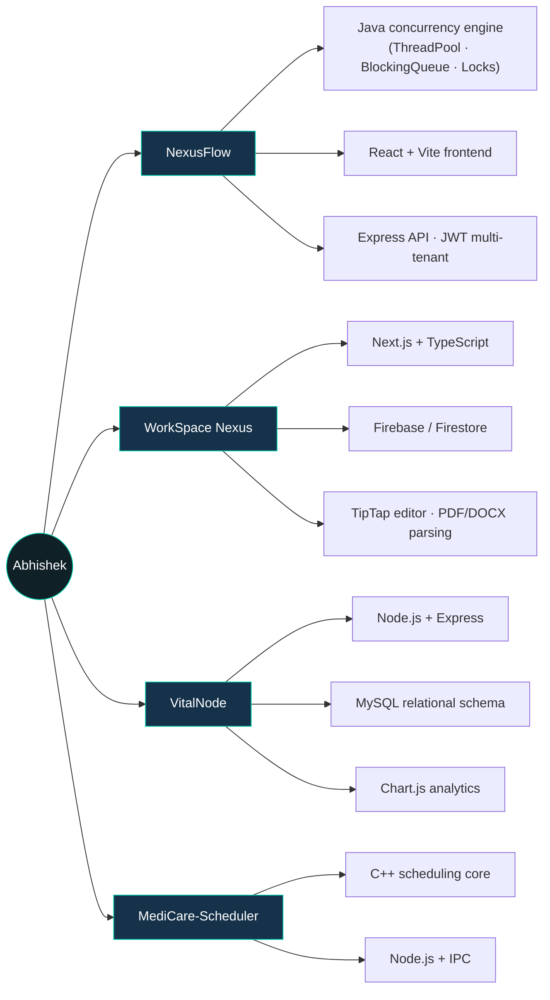

<div align="center">


</div>

<div align="center">

```
$ whoami
> B.Tech CSE student · Pandit Deendayal Energy University, Gujarat · Class of 2028

$ cat interests.txt
> backend engineering · concurrency · system design · data structures & algorithms

$ status --current
> deep in Java concurrency internals, shipping NexusFlow, grinding DSA on LeetCode
```

</div>

<p align="center">
  <a href="#-engineering-philosophy">Philosophy</a> ·
  <a href="#-tech-stack">Stack</a> ·
  <a href="#-project-ecosystem">Projects</a> ·
  <a href="#-github-metrics">Metrics</a> ·
  <a href="#-dsa--problem-solving">DSA</a> ·
  <a href="#-connect">Connect</a>
</p>

<br/>

## 🧭 Engineering Philosophy

Most student projects stop once the feature "works." Mine tend to start there and keep going — into what happens under load, under bad input, under concurrent access.

- **I build the layer beneath the framework.** `NexusFlow`'s thread pool doesn't use `java.util.concurrent` — it's built on raw `ReentrantLock`, `Condition`, and a hand-rolled `BlockingQueue`, because understanding the primitive matters more than calling the utility.
- **I finish systems, not demos.** Several of my projects carry real schemas, real auth flows, and real multi-layer architecture (frontend / API / data) rather than a single-file prototype.
- **I iterate visibly.** My commit history is evidence, not a highlight reel — some projects are early scaffolds, others have dozens of incremental commits. Both are shown honestly below.

<br/>

## 🛠️ Tech Stack

<table>
<tr><td valign="top" width="15%"><b>Languages</b></td><td valign="top">

</td></tr>
<tr><td valign="top"><b>Frontend</b></td><td valign="top">

</td></tr>
<tr><td valign="top"><b>Backend</b></td><td valign="top">

</td></tr>
<tr><td valign="top"><b>Data & Cloud</b></td><td valign="top">

</td></tr>
<tr><td valign="top"><b>Tooling</b></td><td valign="top">

</td></tr>
</table>

**Concepts in active use:** DSA · OOP · DBMS & relational schema design · REST API design · Java concurrency (`ReentrantLock`, `Condition`, custom `BlockingQueue`, thread pools) · System design fundamentals

<br/>

## 🌐 Project Ecosystem

A map of what I build and the technology each piece leans on:



<br/>

### 🧵 NexusFlow — Concurrent Workflow Orchestration Engine
**The flagship project — most technically ambitious in the ecosystem above.**

> **Problem:** Task schedulers built on top of `java.util.concurrent` hide exactly the mechanics worth understanding — queuing discipline, lock contention, fairness.
> **Solution:** A JVM execution engine built from scratch — custom `ThreadPool`, worker loop, and a condition-signaled priority `BlockingQueue`, supporting priority, scheduled, retryable, and cancellable task types with dynamic thread scaling.
> **Wrapped in:** a monorepo — React/Vite frontend for visualization, an Express API layer with JWT-based multi-tenant isolation, and the Java engine communicating underneath.

`Java` `ReentrantLock` `Condition` `Custom BlockingQueue` `React` `Node.js` `MySQL`

<details>
<summary><b>🔍 Architecture notes</b></summary>
<br/>

- Custom `ThreadPool` and `Worker` classes — no reliance on `Executors`
- Priority / Scheduled / Retryable / Cancellable task types as distinct, composable implementations
- API layer isolated by JWT-scoped tenancy so orchestration state stays partitioned per user
- Repository is still early-stage on GitHub (single consolidated commit) — the engineering is real, the commit history isn't polished yet

</details>

**[→ View Repository](https://github.com/ABHISHEK-DHARIYAL/NexusFlow)**

---

### 📁 WorkSpace Nexus — Document Management Platform
**Most actively iterated project — 60+ incremental commits.**

> **Problem:** Teams need a place to create, edit, and parse documents without juggling five disconnected tools.
> **Solution:** A Next.js + TypeScript workspace backed by Firebase/Firestore, with a TipTap rich-text editor, PDF and DOCX ingestion (via Mammoth.js), and an Express API layer secured with JWT.

`Next.js` `TypeScript` `Firebase` `Firestore` `Express` `JWT` `TipTap`

**[→ View Repository](https://github.com/ABHISHEK-DHARIYAL/WorkSpace_Nexus)**

---

### 🏥 VitalNode — Hospital Management System

> **Problem:** Hospital operations span patients, doctors, appointments, billing, and equipment — usually tracked in disconnected spreadsheets.
> **Solution:** A relational MySQL-backed system joining patients, doctors, and appointments, with role-based access via JWT and a Chart.js dashboard for revenue and device-monitoring analytics.

`Node.js` `Express` `MySQL` `EJS` `JWT` `Chart.js`

**[→ View Repository](https://github.com/ABHISHEK-DHARIYAL/VitalNode)**

---

### ⚙️ MediCare-Scheduler — Hospital Patient Scheduling Simulator

> **Problem:** Classic CPU scheduling algorithms are usually taught in isolation, disconnected from a real-world queuing scenario.
> **Solution:** A C++ simulator applying FCFS/SJF/Round-Robin-style scheduling logic to patient queuing, communicating with a Node.js layer via IPC.

`C++` `Scheduling Algorithms` `Node.js` `IPC`

<sub>⚠️ Not currently visible among pinned repositories — confirm this repo is public, then update the link above.</sub>

<br/>

## 📊 GitHub Metrics

<div align="center">


</div>

**Commit activity, at a glance:**

<div align="center">

</div>

<details>
<summary><b>🐍 Add the contribution snake (optional, one-time setup)</b></summary>
<br/>

GitHub's contribution graph can be animated into a "snake" that eats your own contribution squares, generated by a scheduled GitHub Action in your own account:

1. Create a repo named exactly `ABHISHEK-DHARIYAL` (a special "profile" repo, if not already this one).
2. Add the workflow from [`Platane/snk`](https://github.com/Platane/snk) — it commits an SVG on a schedule.
3. Embed the generated SVG:
   ```md
   
   ```

This isn't embedded by default here since it requires a GitHub Action running under your own account — nothing external can generate it for you.

</details>

<br/>

## 🧠 DSA & Problem Solving

Consistent practice on **LeetCode**, currently centered on graph algorithms, DSU/Union-Find, greedy strategies, and prefix-sum optimizations.

<div align="center">
?theme=dark&font=baloo%202&ext=heatmap" width="90%"/>
</div>

<sub>⚠️ Swap in your real LeetCode handle above — this card renders live data once the placeholder is replaced.</sub>

<br/>

## 🎯 Currently Building / Learning

```
┌─ NOW ─────────────────────────────────────────────┐
│ → Extending NexusFlow's scheduling & retry logic   │
│ → Deepening Java concurrency (lock-free patterns)  │
│ → Daily DSA practice — graphs, DP, advanced trees  │
├─ NEXT ────────────────────────────────────────────┤
│ → Distributed systems fundamentals                 │
│ → Formal system design practice (scaling, caching) │
└─────────────────────────────────────────────────────┘
```

<br/>

## 📫 Connect

<div align="center">

[](https://linkedin.com/in/<your-linkedin-handle>)
[](mailto:your-email@example.com)
[](https://leetcode.com/<your-leetcode-username>)
[](https://your-portfolio-link.com)

</div>

<div align="center">
<sub>Thanks for reading this far — that already puts you in the "technical" bucket. 🛠️</sub>
</div>

<br/>


